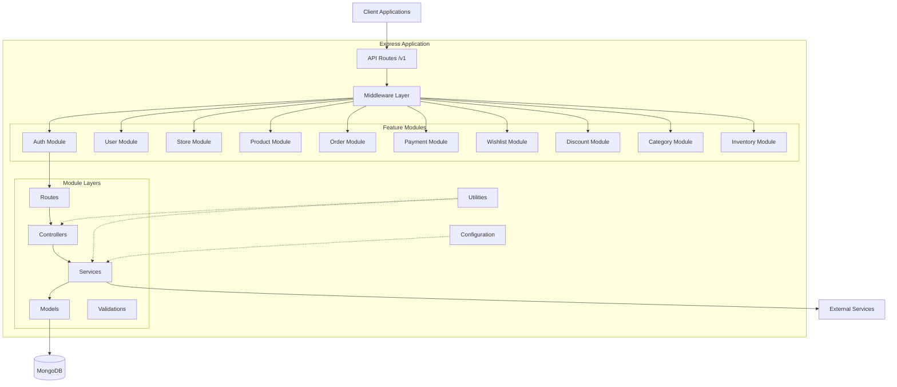
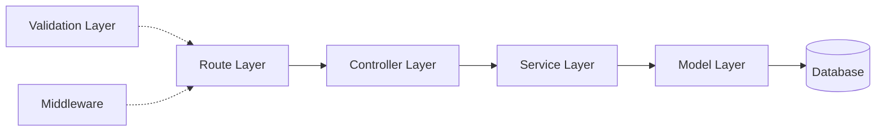
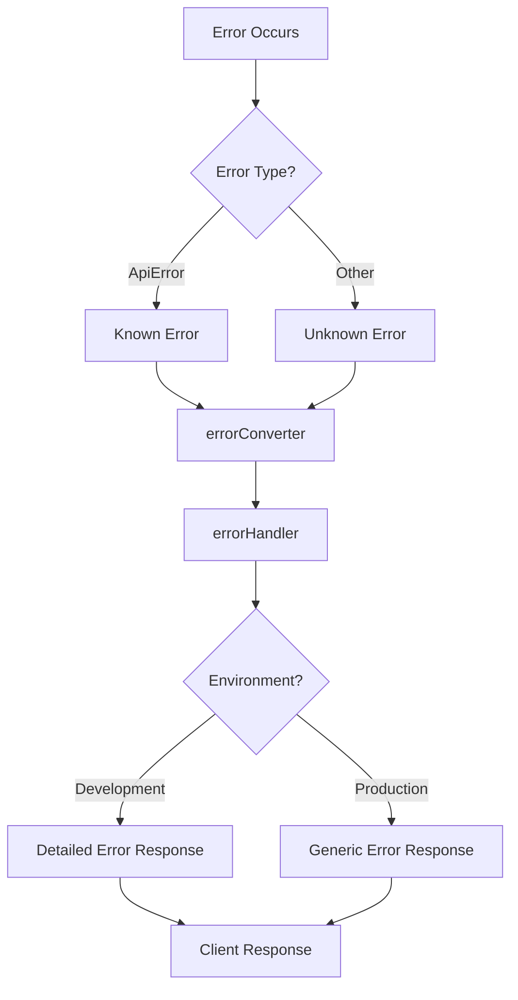
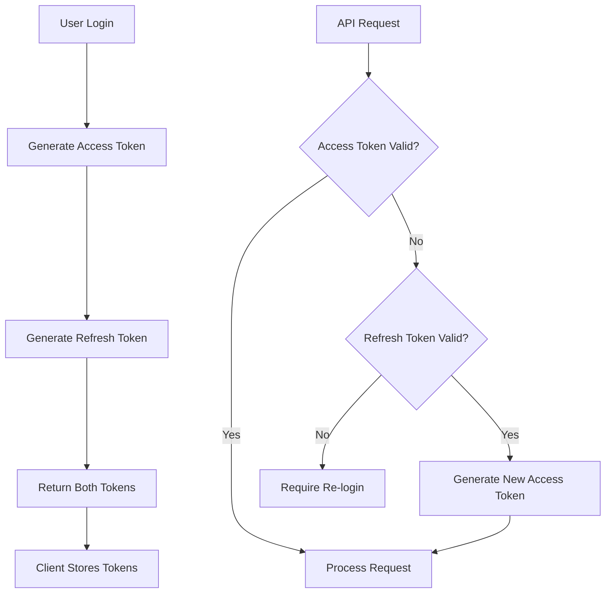

# Architecture & Design Patterns

## Architectural Overview

The Multi-Store E-Commerce Backend follows a **Feature-Based Modular Architecture** combined with a **Layered Architecture** pattern. This approach promotes scalability, maintainability, and clear separation of concerns.



## Architectural Patterns

### 1. Feature-Based Modular Architecture

Each feature is self-contained within its own directory with all related components:

```
features/v1/[feature-name]/
├── [feature].route.js       # Route definitions
├── [feature].controller.js  # Request handlers
├── [feature].service.js     # Business logic
├── [feature].model.js       # Data model
├── [feature].validation.js  # Input validation
└── index.js                 # Module exports
```

**Benefits:**
- **Scalability**: Easy to add new features without affecting existing ones
- **Maintainability**: Related code is co-located
- **Team collaboration**: Different teams can work on different features
- **Code reusability**: Features can be easily extracted or reused

### 2. Layered Architecture

Each feature module follows a consistent layered structure:



#### Layer Responsibilities

| Layer | Responsibility | Example |
|-------|---------------|---------|
| **Routes** | Define API endpoints and HTTP methods | `router.post('/login', validate(...), controller.login)` |
| **Controllers** | Handle HTTP requests/responses, orchestrate service calls | Extract request data, call services, format responses |
| **Services** | Business logic, data manipulation, external API calls | User authentication, order processing, payment initialization |
| **Models** | Data structure, validation, database interaction | Mongoose schemas, static methods, instance methods |
| **Validations** | Input validation schemas | Joi schemas for request body, params, query |

### 3. Middleware Pipeline Architecture

Requests flow through a series of middleware before reaching route handlers:


## Design Considerations

### 1. Security-First Design

**Implementation:**
- JWT-based authentication with separate access and refresh tokens
- Password hashing using bcrypt (8 rounds)
- XSS protection via `xss-clean`
- NoSQL injection prevention via `express-mongo-sanitize`
- Security headers via `helmet`
- Rate limiting on authentication endpoints
- CORS configuration for controlled access

**Code Example:**
```javascript
// app.js - Security middleware stack
app.use(helmet());                    // Security headers
app.use(xss());                       // XSS protection
app.use(mongoSanitize());            // NoSQL injection prevention
app.use(cors());                      // CORS
if (config.env === 'production') {
  app.use('/v1/auth', authLimiter);  // Rate limiting
}
```

### 2. Separation of Concerns

Each component has a single, well-defined responsibility:

- **Routes**: Define API structure
- **Controllers**: Handle HTTP layer
- **Services**: Implement business logic
- **Models**: Define data structure
- **Middleware**: Cross-cutting concerns
- **Utils**: Shared functionality

### 3. DRY (Don't Repeat Yourself)

**Reusable Components:**
- **Middleware**: `auth`, `validate`, `validateFormData`, `catchAsync`
- **Utils**: `ApiError`, `pick`, `catchAsync`
- **Plugins**: `toJSON`, `paginate` (Mongoose plugins)
- **Config**: Centralized configuration management

### 4. Error Handling Strategy

Centralized error handling with custom error classes:



**Implementation:**
```javascript
// Custom error class
class ApiError extends Error {
  constructor(statusCode, message, isOperational = true, stack = '') {
    super(message);
    this.statusCode = statusCode;
    this.isOperational = isOperational;
    if (stack) {
      this.stack = stack;
    } else {
      Error.captureStackTrace(this, this.constructor);
    }
  }
}

// Error converter middleware
const errorConverter = (err, req, res, next) => {
  let error = err;
  if (!(error instanceof ApiError)) {
    const statusCode = error.statusCode || httpStatus.INTERNAL_SERVER_ERROR;
    const message = error.message || httpStatus[statusCode];
    error = new ApiError(statusCode, message, false, err.stack);
  }
  next(error);
};

// Error handler middleware
const errorHandler = (err, req, res, next) => {
  let { statusCode, message } = err;
  if (config.env === 'production' && !err.isOperational) {
    statusCode = httpStatus.INTERNAL_SERVER_ERROR;
    message = httpStatus[httpStatus.INTERNAL_SERVER_ERROR];
  }
  res.locals.errorMessage = err.message;
  const response = {
    code: statusCode,
    message,
    ...(config.env === 'development' && { stack: err.stack }),
  };
  if (config.env === 'development') {
    logger.error(err);
  }
  res.status(statusCode).send(response);
};
```

### 5. Validation Strategy

Two-tier validation approach:

**Tier 1: Schema Validation (Joi)**
```javascript
// Validation middleware
const validate = (schema) => (req, res, next) => {
  const validSchema = pick(schema, ['params', 'query', 'body']);
  const object = pick(req, Object.keys(validSchema));
  const { value, error } = Joi.compile(validSchema)
    .prefs({ errors: { label: 'key' }, abortEarly: false })
    .validate(object);
  
  if (error) {
    const errorMessage = error.details
      .map((details) => details.message)
      .join(', ');
    return next(new ApiError(httpStatus.BAD_REQUEST, errorMessage));
  }
  Object.assign(req, value);
  return next();
};
```

**Tier 2: Model Validation (Mongoose)**
```javascript
// Model-level validation
const userSchema = mongoose.Schema({
  email: {
    type: String,
    required: true,
    unique: true,
    validate(value) {
      if (!validator.isEmail(value)) {
        throw new Error('Invalid email');
      }
    },
  },
  password: {
    type: String,
    required: true,
    minlength: 8,
    validate(value) {
      if (!value.match(/\d/) || !value.match(/[a-zA-Z]/)) {
        throw new Error('Password must contain at least one letter and one number');
      }
    },
  },
});
```

### 6. Database Design Principles

**Indexing Strategy:**
```javascript
// Text search indexes
productSchema.index({
  name: 'text',
  description: 'text',
  category: 'text',
  'specifications.name': 'text',
  'specifications.value': 'text',
});

// Compound indexes for common queries
productSchema.index({ category: 1, price: 1 });
productSchema.index({ 'inventory.sku': 1 });
```

**Plugin-Based Extensions:**
```javascript
// Reusable plugins for all models
userSchema.plugin(toJSON);      // Transform _id to id, remove private fields
userSchema.plugin(paginate);    // Add pagination methods
```

### 7. Authentication Architecture

**Dual-Token Strategy:**



**Passport Strategies:**
- `jwt`: Access token authentication (Bearer token)
- `jwt-refresh`: Refresh token authentication (cookie/body/header)

### 8. File Upload Strategy

**Dual Upload System:**
1. **express-fileupload**: Temporary file storage in `/tmp/`
2. **Cloudinary**: Permanent cloud storage

**Flow:**
```
Client Upload → Temp Storage (/tmp/) → Cloudinary → Database (URL) → Delete Temp File
```

### 9. Logging Strategy

**Winston Logger:**
- **Development**: Console output with colors
- **Production**: File-based logging with rotation
- **Error tracking**: Separate error logs

**Morgan HTTP Logger:**
- **Success**: HTTP requests with response time
- **Error**: Failed requests with error details

## Project Structure

```
server/
├── src/
│   ├── app.js                      # Express app setup
│   ├── index.js                    # Entry point
│   │
│   ├── config/                     # Configuration
│   │   ├── config.js              # Environment config
│   │   ├── logger.js              # Winston logger
│   │   ├── morgan.js              # HTTP logger
│   │   ├── passport.js            # Passport strategies
│   │   ├── roles.js               # RBAC configuration
│   │   ├── tokens.js              # Token types
│   │   └── otp.js                 # OTP configuration
│   │
│   ├── features/v1/               # Feature modules
│   │   ├── auth/                  # Authentication
│   │   ├── user/                  # User management
│   │   ├── store/                 # Store management
│   │   ├── product/               # Product management
│   │   ├── order/                 # Order management
│   │   ├── payment/               # Payment processing
│   │   │   └── paystack/         # Paystack integration
│   │   ├── wishlist/              # Wishlist management
│   │   ├── discount/              # Discount management
│   │   ├── category/              # Category management
│   │   ├── inventory/             # Inventory tracking
│   │   ├── useraddress/           # Address management
│   │   ├── otp-token/             # OTP management
│   │   ├── review/                # Product reviews
│   │   ├── customization/         # Store customization
│   │   └── admin/                 # Admin operations
│   │
│   ├── middlewares/               # Custom middleware
│   │   ├── auth.js               # Authentication middleware
│   │   ├── validate.js           # Validation middleware
│   │   ├── validateFormData.js   # Form data validation
│   │   ├── error.js              # Error handling
│   │   ├── rateLimiter.js        # Rate limiting
│   │   ├── isStoreOwner.js       # Store ownership check
│   │   ├── productExitInStore.js # Product existence check
│   │   └── deviceDetector.js     # Device detection
│   │
│   ├── routes/v1/                 # API routes
│   │   └── index.js              # Route aggregator
│   │
│   ├── utils/                     # Utilities
│   │   ├── ApiError.js           # Custom error class
│   │   ├── catchAsync.js         # Async error wrapper
│   │   ├── pick.js               # Object picker
│   │   ├── transform.js          # Data transformation
│   │   ├── default.js            # Default values
│   │   ├── buildQueryProduct.js  # Query builder
│   │   └── plugins/              # Mongoose plugins
│   │
│   ├── validations/               # Shared validations
│   │   └── custom.validation.js  # Custom validators
│   │
│   ├── libs/                      # External libraries
│   │   └── cloudinary-config.js  # Cloudinary setup
│   │
│   └── docs/                      # Swagger docs
│       └── swaggerDef.js         # Swagger definition
│
├── docs/                          # Documentation
├── uploads/                       # Temporary uploads
├── tmp/                           # Temporary files
├── .env                           # Environment variables
├── ecosystem.config.json          # PM2 configuration
└── package.json                   # Dependencies
```

## Design Patterns Used

### 1. **Factory Pattern**
Used in model creation and service instantiation.

### 2. **Middleware Pattern**
Express middleware for cross-cutting concerns.

### 3. **Repository Pattern**
Services act as repositories for data access.

### 4. **Strategy Pattern**
Passport authentication strategies (jwt, jwt-refresh).

### 5. **Plugin Pattern**
Mongoose plugins for reusable model functionality.

### 6. **Singleton Pattern**
Database connection, logger, configuration.

## Scalability Considerations

1. **Horizontal Scaling**: Stateless design allows multiple instances
2. **Database Indexing**: Optimized queries for performance
3. **Caching Strategy**: Ready for Redis integration
4. **Load Balancing**: PM2 cluster mode support
5. **Microservices Ready**: Feature modules can be extracted

## Next Steps

- [System Flow](./03-system-flow.md) - Understand request processing
- [Data Models](./06-data-models.md) - Explore database schemas
- [Authentication](./07-authentication.md) - Deep dive into auth system
