# System Flow & Diagrams

## System Architecture Flow

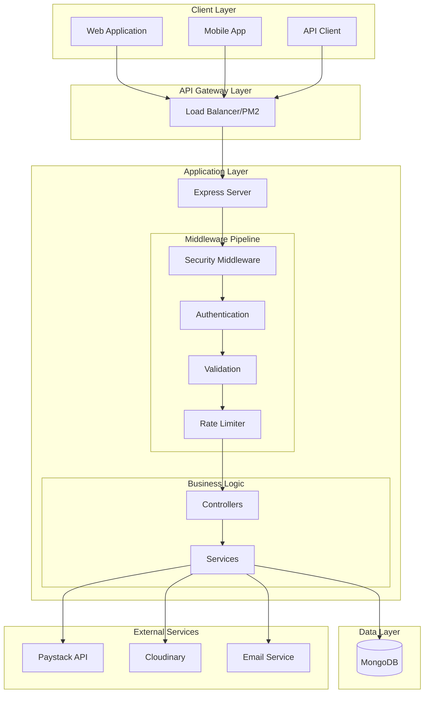

## Request/Response Lifecycle

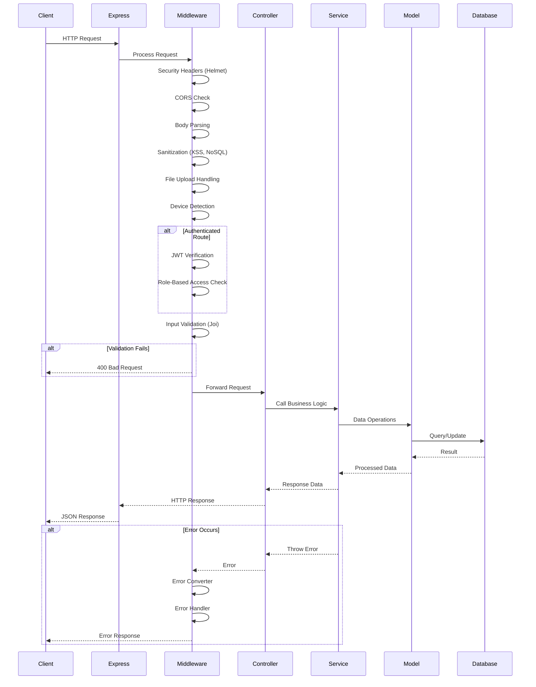

## Authentication Flow

### User Registration Flow

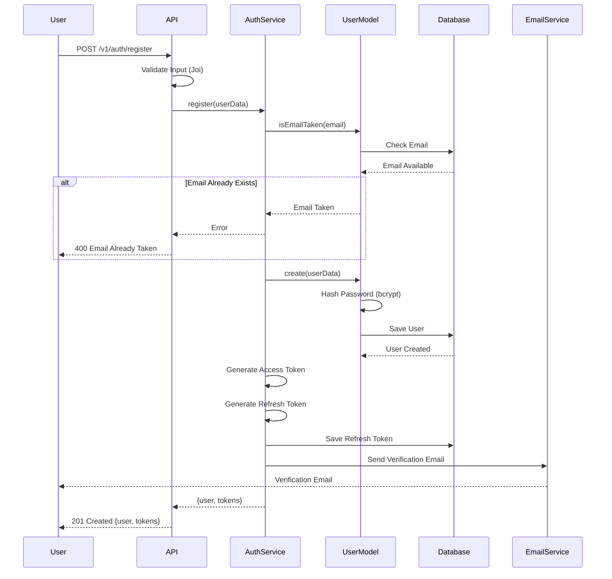

### Login Flow

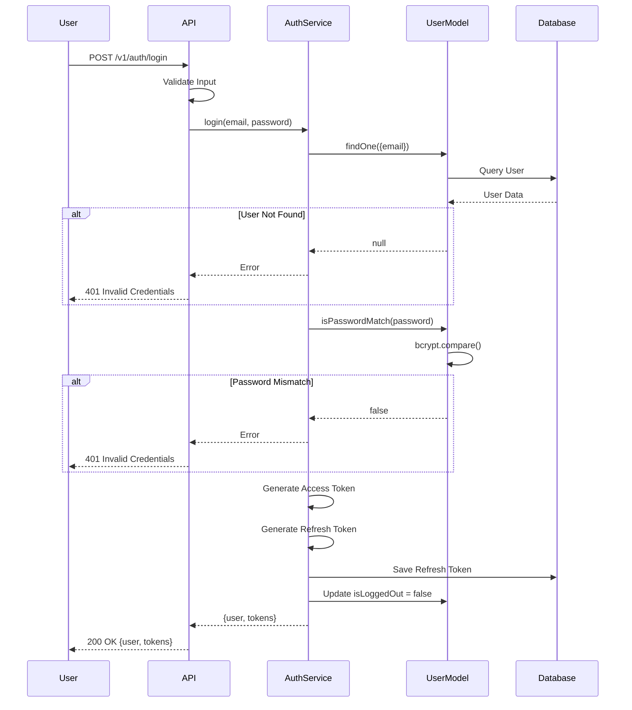

### Token Refresh Flow

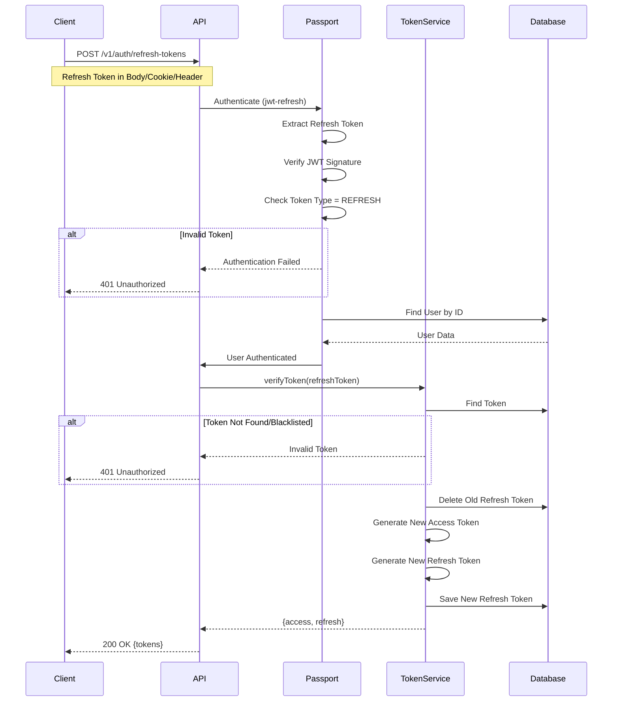

## Payment Processing Flow

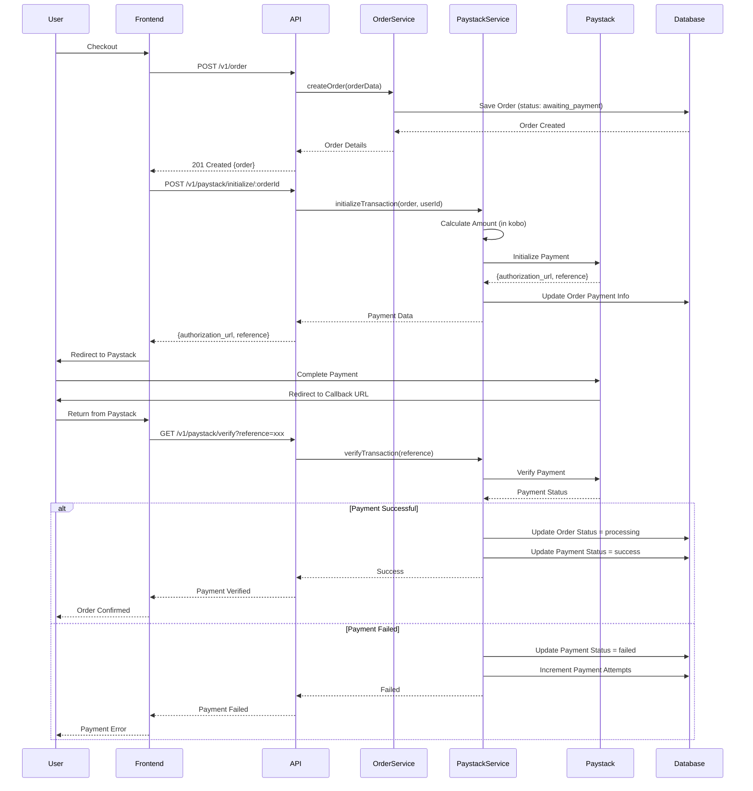

## Order Fulfillment Flow

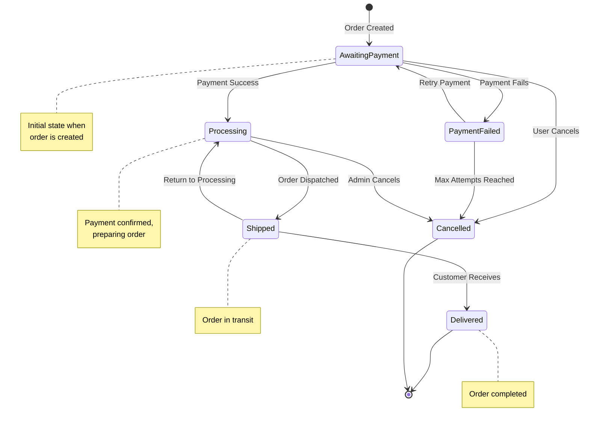

## Product Search & Filter Flow

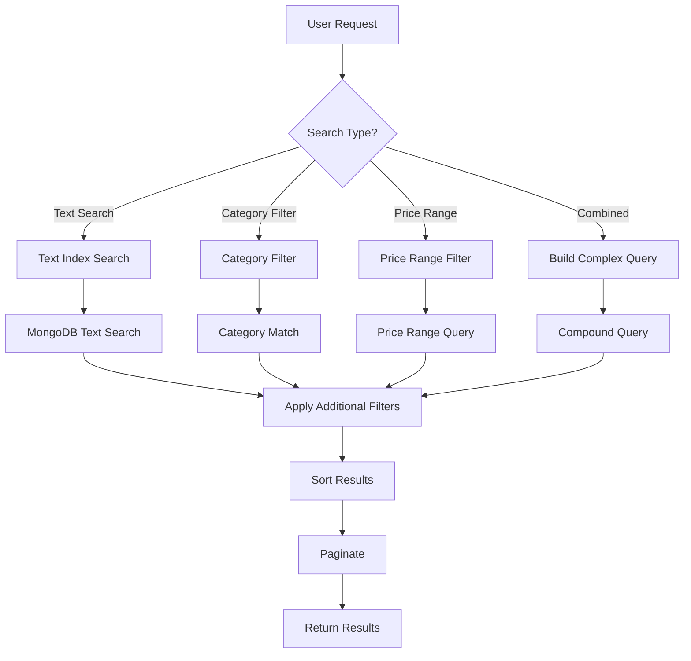

## Inventory Management Flow

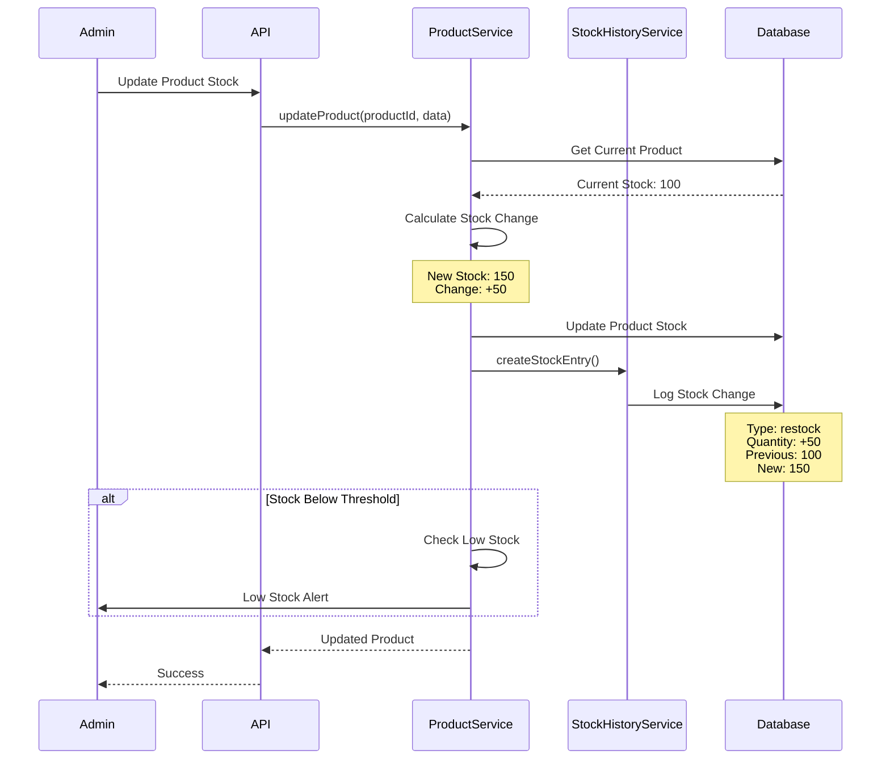

## Discount Application Flow

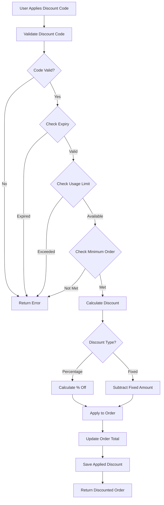

## File Upload Flow

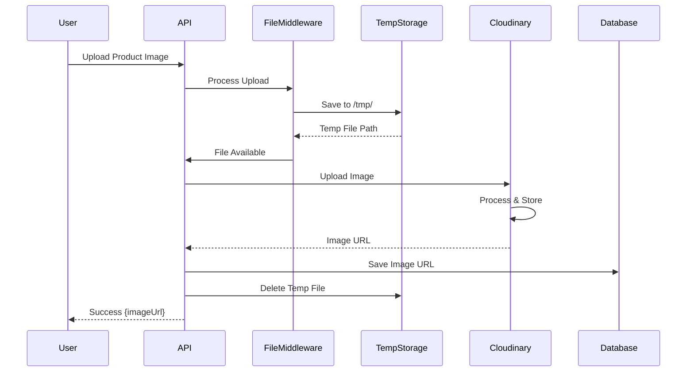

## Email Verification Flow

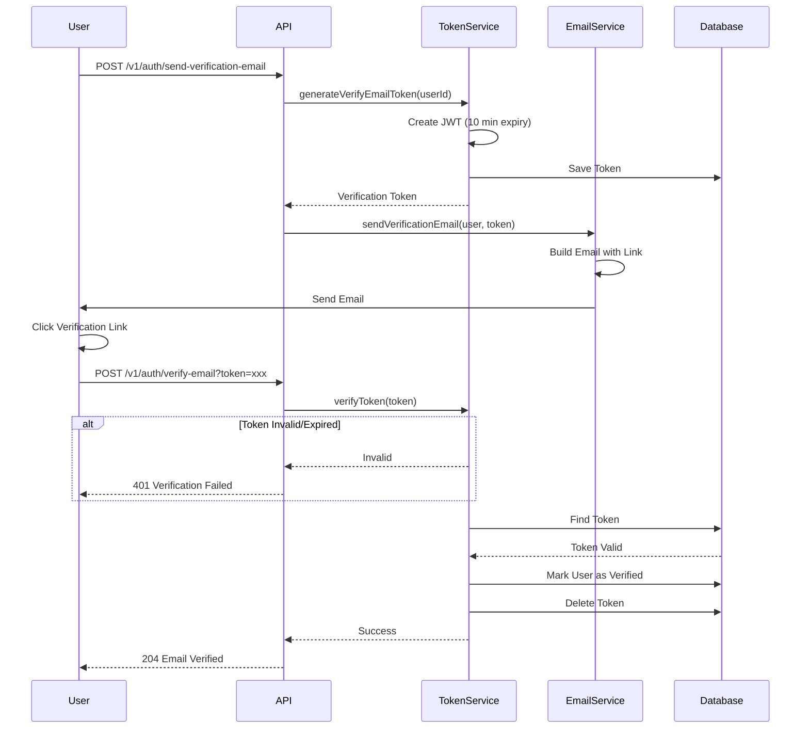

## Role-Based Access Control Flow

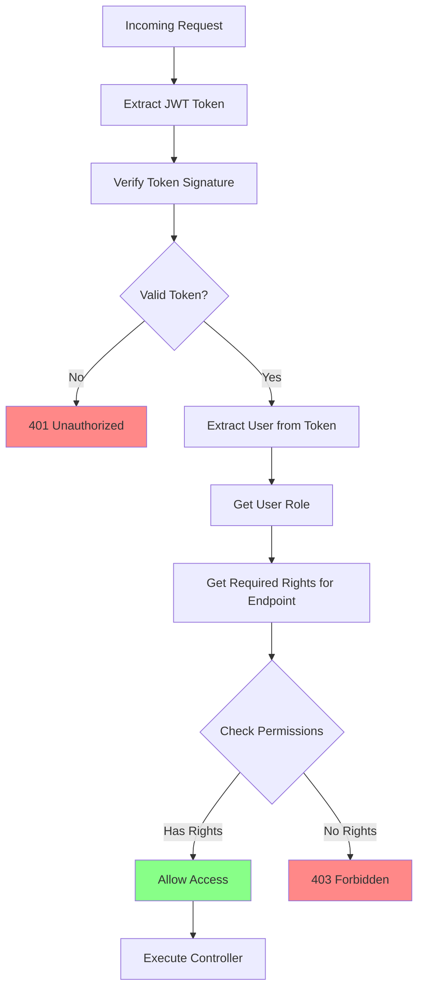

## Next Steps

- [User Flows](./04-user-flows.md) - Explore user journey scenarios
- [API Endpoints](./05-api-endpoints.md) - Complete endpoint reference
- [Authentication](./07-authentication.md) - Authentication deep dive
