# User Flows & Journey Maps

## User Roles

The system supports three primary user roles:

| Role | Description | Key Capabilities |
|------|-------------|------------------|
| **Buyer** | Regular customers | Browse products, make purchases, manage wishlist, track orders |
| **Seller** | Store owners | Manage store, products, inventory, view orders |
| **Admin** | System administrators | Full system access, user management, platform oversight |

## Buyer Journey Flows

### 1. New Buyer Registration & First Purchase

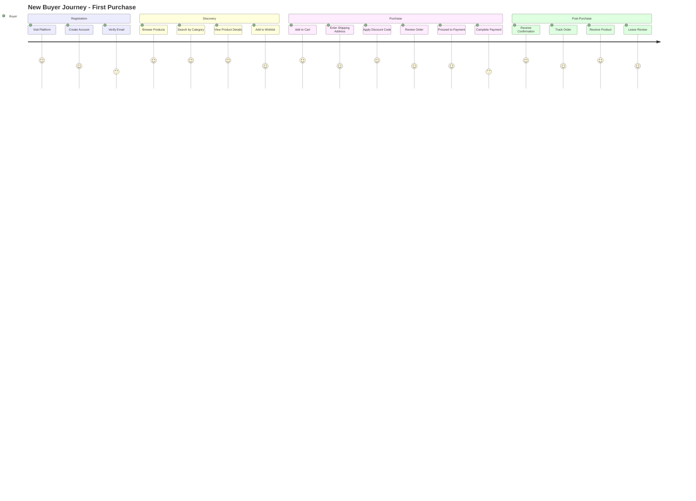

### 2. Product Discovery Flow

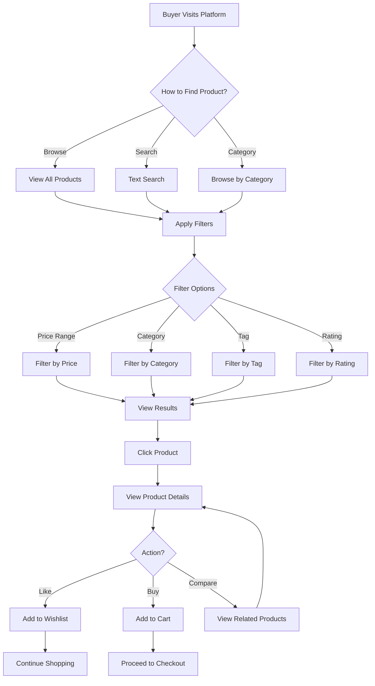

### 3. Checkout & Payment Flow

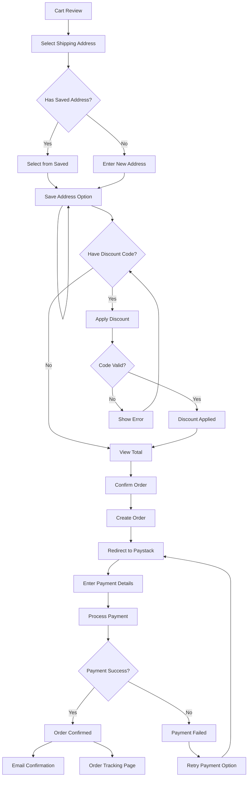

### 4. Order Tracking Flow

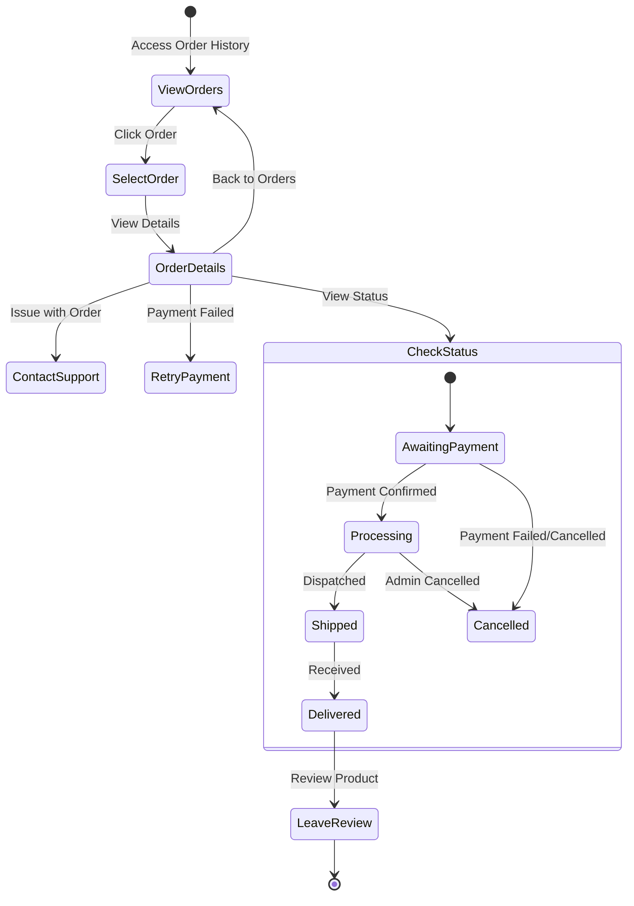

## Seller Journey Flows

### 1. Seller Onboarding

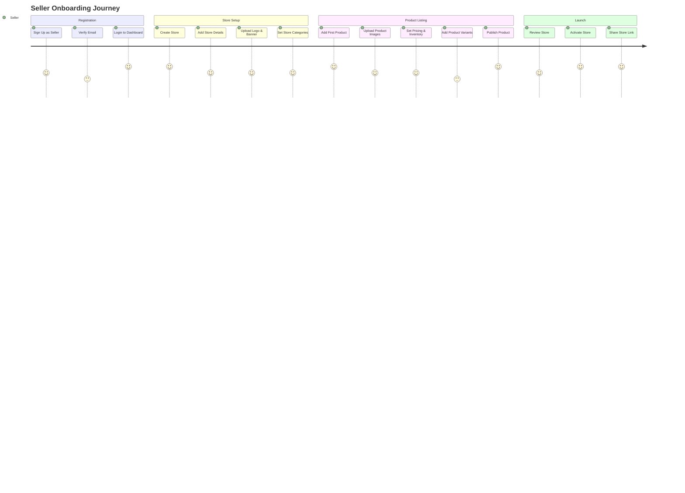

### 2. Product Management Flow

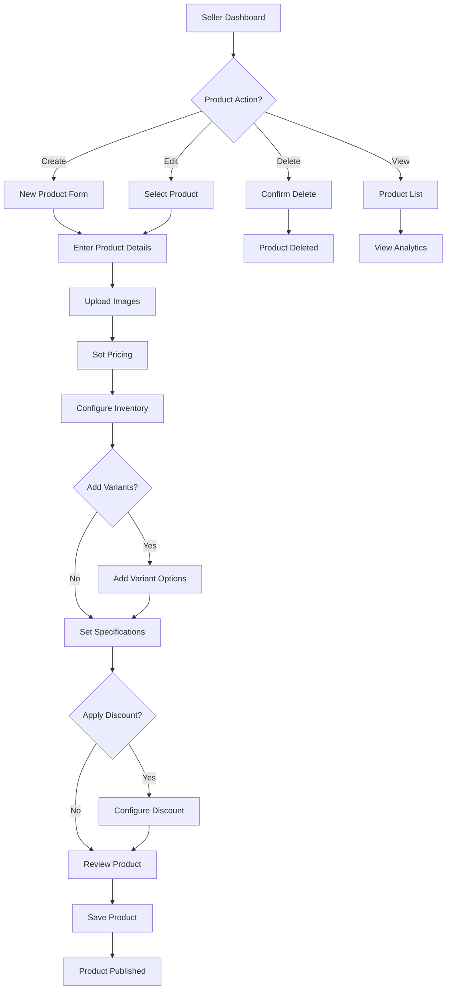

### 3. Inventory Management Flow

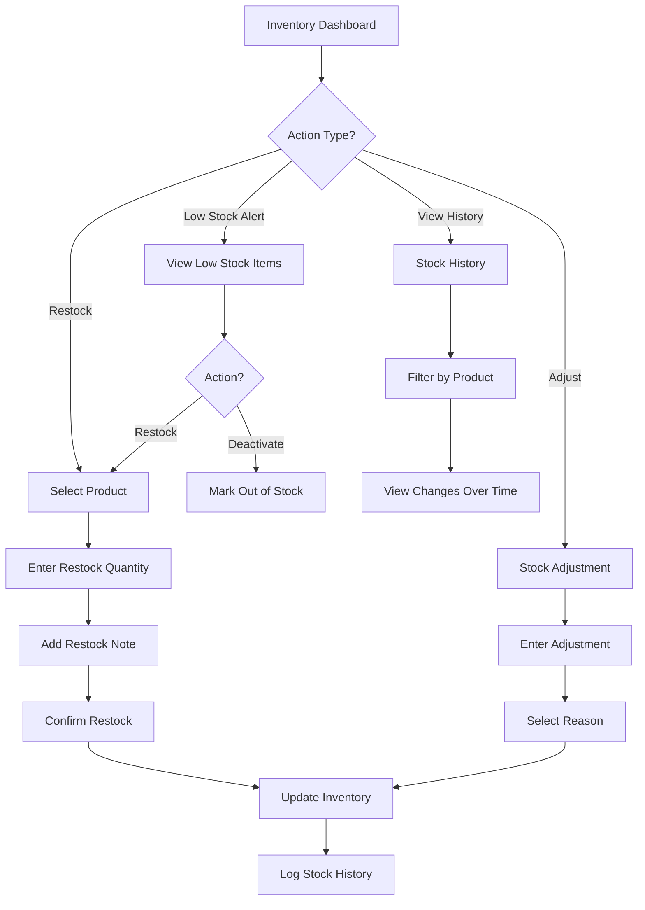

### 4. Order Fulfillment Flow

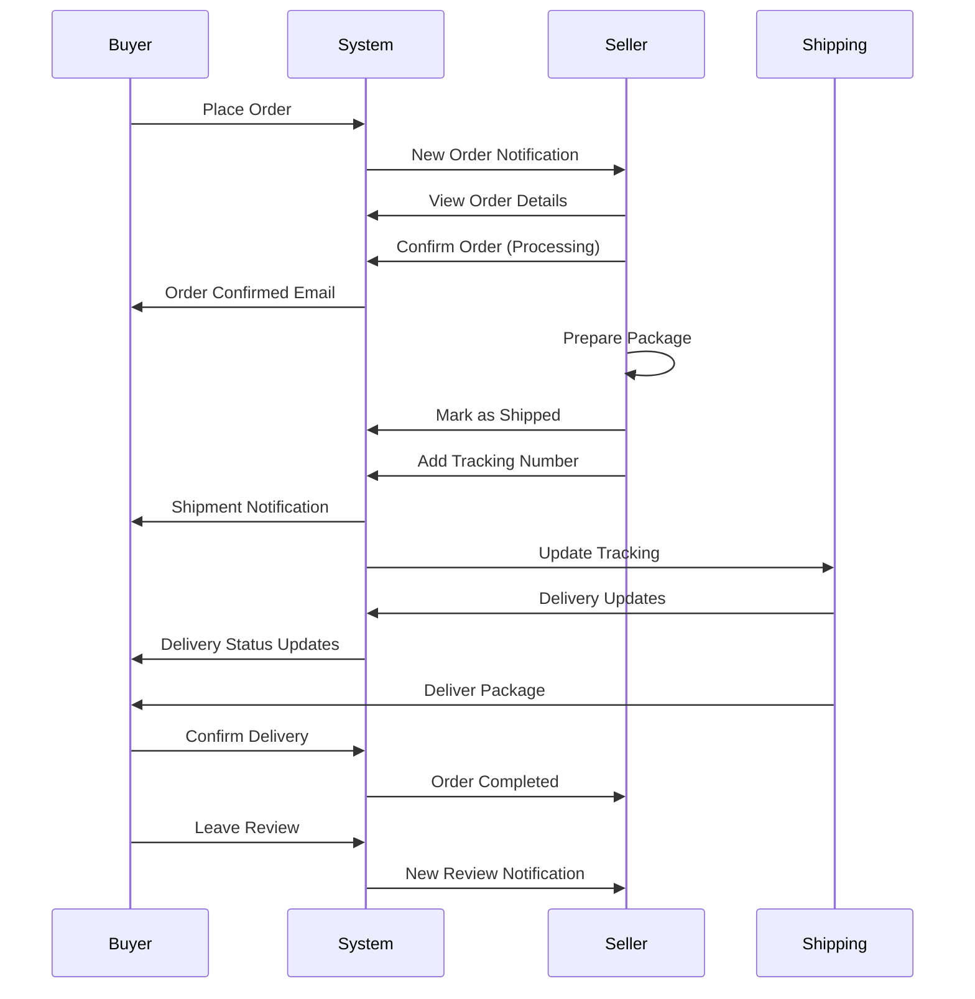

## Admin Journey Flows

### 1. Platform Management Flow

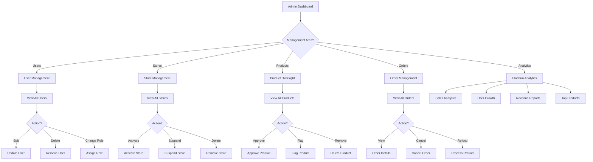

### 2. Discount Management Flow

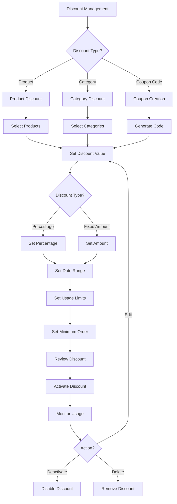

## Common User Scenarios

### Scenario 1: Buyer Finds and Purchases Product

```mermaid
graph LR
    A[Search for 'laptop'] --> B[View Results]
    B --> C[Filter: $500-$1000]
    C --> D[Sort: Highest Rated]
    D --> E[Click Product]
    E --> F[View Details & Reviews]
    F --> G[Add to Cart]
    G --> H[Apply Coupon: SAVE10]
    H --> I[Checkout]
    I --> J[Pay with Paystack]
    J --> K[Order Confirmed]
```

### Scenario 2: Seller Manages Low Stock

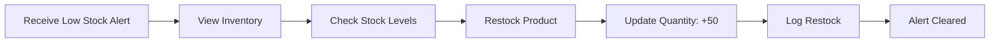

### Scenario 3: Admin Handles Dispute

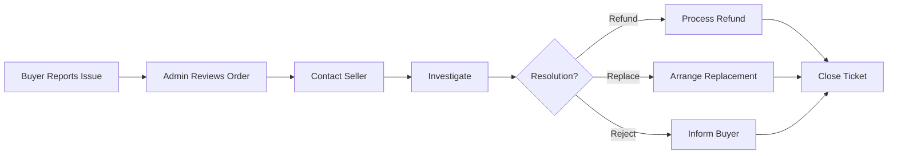

## Mobile vs Web User Experience

### Key Differences

| Feature | Web Experience | Mobile Experience |
|---------|---------------|-------------------|
| **Navigation** | Full menu, sidebar | Hamburger menu, bottom nav |
| **Product View** | Grid layout, multiple columns | Single column, swipeable images |
| **Checkout** | Multi-step form | Progressive disclosure |
| **Payment** | Desktop Paystack flow | Mobile-optimized Paystack |
| **Notifications** | Email + in-app | Push notifications + email |

## User Pain Points & Solutions

| Pain Point | Solution Implemented |
|-----------|---------------------|
| Forgotten passwords | Password reset via email |
| Lost orders | Order tracking with email updates |
| Complex checkout | Saved addresses, one-click reorder |
| Unclear pricing | Transparent pricing with discount display |
| Payment failures | Retry mechanism with clear error messages |
| Stock unavailability | Real-time inventory updates |
| Slow search | Text indexing for fast search |
| Spam emails | Email verification, opt-in preferences |

## Next Steps

- [API Endpoints](./05-api-endpoints.md) - Complete API reference
- [Data Models](./06-data-models.md) - Database schemas
- [System Flow](./03-system-flow.md) - Technical flow diagrams
