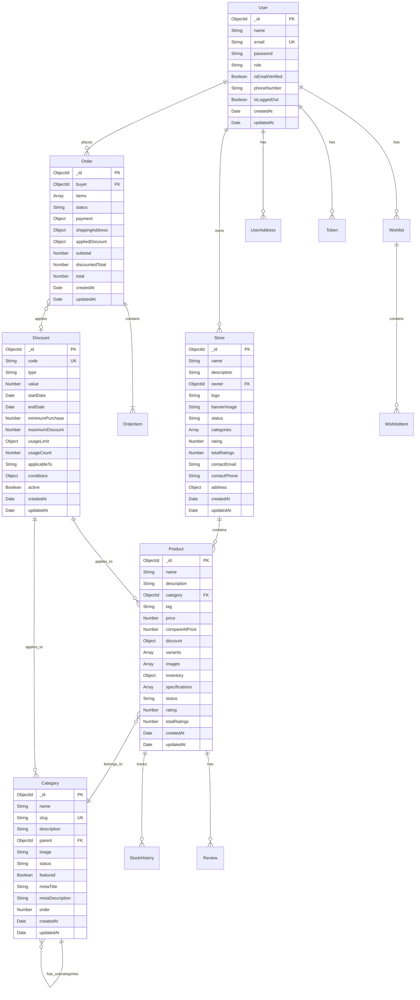

# Data Models & Database Schema

## Database Overview

The application uses **MongoDB** as its database with **Mongoose** as the ODM (Object Data Modeling) library. The database follows a document-based structure with relationships established through ObjectId references.

## Entity Relationship Diagram



## Model Schemas

### User Model

**Collection:** `users`

```javascript
{
  _id: ObjectId,
  name: String (required),
  email: String (required, unique, lowercase),
  password: String (required, min: 8, hashed),
  role: String (enum: ['buyer', 'seller', 'admin'], default: 'buyer'),
  isEmailVerified: Boolean (default: false),
  phoneNumber: String,
  isLoggedOut: Boolean (default: true),
  createdAt: Date,
  updatedAt: Date
}
```

**Indexes:**
- `email`: Unique index
- Default MongoDB `_id` index

**Methods:**
- `isEmailTaken(email, excludeUserId)`: Check if email is already registered
- `isPasswordMatch(password)`: Verify password against hash

**Hooks:**
- `pre('save')`: Hash password before saving if modified

**Validations:**
- Email must be valid format
- Password must contain at least one letter and one number

---

### Store Model

**Collection:** `stores`

```javascript
{
  _id: ObjectId,
  name: String (required),
  description: String,
  owner: ObjectId (ref: 'User', required),
  logo: String (URL),
  bannerImage: String (URL),
  status: String (enum: ['active', 'inactive', 'suspended'], default: 'active'),
  categories: [String],
  rating: Number (default: 0),
  totalRatings: Number (default: 0),
  contactEmail: String,
  contactPhone: String,
  address: {
    street: String,
    city: String,
    state: String,
    country: String,
    zipCode: String
  },
  createdAt: Date (default: Date.now),
  updatedAt: Date (default: Date.now)
}
```

**Indexes:**
- `owner`: Index for faster owner queries

**Relationships:**
- `owner` → References `User` model

---

### Product Model

**Collection:** `products`

```javascript
{
  _id: ObjectId,
  name: String (required),
  description: String (required),
  category: ObjectId (ref: 'Category', required),
  tag: String (enum: ['latest', 'featured', 'regular', 'sale'], default: 'regular'),
  price: Number (required),
  compareAtPrice: Number,
  discount: {
    type: String (enum: ['percentage', 'fixed'], default: 'percentage'),
    value: Number (default: 0),
    startDate: Date,
    endDate: Date,
    active: Boolean (default: false)
  },
  variants: [{
    name: String,
    options: [String],
    price: Number,
    quantity: Number,
    sku: String,
    discount: {
      type: String,
      value: Number,
      startDate: Date,
      endDate: Date,
      active: Boolean
    }
  }],
  images: [String],
  inventory: {
    quantity: Number (required),
    sku: String (required),
    lowStockThreshold: Number (default: 5),
    sold: Number (default: 0)
  },
  specifications: [{
    name: String,
    value: String
  }],
  status: String (enum: ['active', 'inactive', 'out_of_stock', 'deactivated'], default: 'active'),
  rating: Number (default: 0),
  totalRatings: Number (default: 0),
  createdAt: Date (default: Date.now),
  updatedAt: Date (default: Date.now)
}
```

**Indexes:**
- Text index: `name`, `description`, `category`, `specifications.name`, `specifications.value`, `variants.name`, `variants.options`
- Compound index: `category`, `price`
- Index: `inventory.sku`

**Relationships:**
- `category` → References `Category` model

---

### Order Model

**Collection:** `orders`

```javascript
{
  _id: ObjectId,
  buyer: ObjectId (ref: 'User', required),
  items: [{
    product: ObjectId (ref: 'Product', required),
    quantity: Number (required),
    price: Number (required),
    variant: {
      name: String,
      option: String
    }
  }],
  status: String (enum: [
    'awaiting_payment',
    'payment_failed',
    'processing',
    'shipped',
    'delivered',
    'cancelled'
  ], default: 'awaiting_payment'),
  payment: {
    reference: String,
    status: String (enum: ['pending', 'success', 'failed'], default: 'pending'),
    amount: Number,
    paymentDate: Date,
    gateway: String (default: 'paystack'),
    attempts: Number (default: 0),
    lastAttempt: Date,
    authorization_url: String,
    transaction_id: String
  },
  shippingAddress: {
    street: String,
    city: String,
    state: String,
    country: String,
    zipCode: String
  },
  appliedDiscount: {
    code: String,
    type: String (enum: ['percentage', 'fixed']),
    value: Number,
    amount: Number,
    discountId: ObjectId (ref: 'Discount')
  },
  subtotal: Number,
  discountedTotal: Number,
  total: Number,
  createdAt: Date (default: Date.now),
  updatedAt: Date (default: Date.now)
}
```

**Relationships:**
- `buyer` → References `User` model
- `items.product` → References `Product` model
- `appliedDiscount.discountId` → References `Discount` model

---

### Category Model

**Collection:** `categories`

```javascript
{
  _id: ObjectId,
  name: String (required, trim),
  slug: String (required, unique, lowercase),
  description: String,
  parent: ObjectId (ref: 'Category', default: null),
  image: String (URL),
  status: String (enum: ['active', 'inactive'], default: 'active'),
  featured: Boolean (default: false),
  metaTitle: String,
  metaDescription: String,
  order: Number (default: 0),
  createdAt: Date (default: Date.now),
  updatedAt: Date (default: Date.now)
}
```

**Indexes:**
- `slug`: Unique index
- `parent`: Index
- `status`: Index

**Relationships:**
- `parent` → Self-reference for hierarchical categories

---

### Discount Model

**Collection:** `discounts`

```javascript
{
  _id: ObjectId,
  code: String (required, unique, uppercase),
  type: String (enum: ['percentage', 'fixed'], required),
  value: Number (required),
  startDate: Date (required),
  endDate: Date (required),
  minimumPurchase: Number (default: 0),
  maximumDiscount: Number,
  usageLimit: {
    perCustomer: Number (default: 1),
    total: Number
  },
  usageCount: Number (default: 0),
  applicableTo: String (enum: ['all', 'category', 'product', 'variant'], default: 'all'),
  conditions: {
    categories: [String],
    products: [ObjectId] (ref: 'Product'),
    excludedProducts: [ObjectId] (ref: 'Product')
  },
  active: Boolean (default: true),
  createdAt: Date (default: Date.now),
  updatedAt: Date (default: Date.now)
}
```

**Indexes:**
- `code`: Unique index

**Methods:**
- `isValid(userId, cartTotal)`: Validate discount code
- `calculateDiscount(originalPrice)`: Calculate discount amount

**Relationships:**
- `conditions.products` → References `Product` model
- `conditions.excludedProducts` → References `Product` model

---

### Wishlist Model

**Collection:** `wishlists`

```javascript
{
  _id: ObjectId,
  user: ObjectId (ref: 'User', required),
  products: [{
    product: ObjectId (ref: 'Product', required),
    addedAt: Date (default: Date.now)
  }],
  createdAt: Date,
  updatedAt: Date
}
```

**Indexes:**
- `user`: Index for faster user queries

**Relationships:**
- `user` → References `User` model
- `products.product` → References `Product` model

---

### StockHistory Model

**Collection:** `stockhistories`

```javascript
{
  _id: ObjectId,
  product: ObjectId (ref: 'Product', required),
  type: String (enum: ['restock', 'sale', 'adjustment', 'return'], required),
  quantity: Number (required),
  previousQuantity: Number (required),
  newQuantity: Number (required),
  reason: String,
  performedBy: ObjectId (ref: 'User'),
  createdAt: Date (default: Date.now)
}
```

**Relationships:**
- `product` → References `Product` model
- `performedBy` → References `User` model

---

### UserAddress Model

**Collection:** `useraddresses`

```javascript
{
  _id: ObjectId,
  user: ObjectId (ref: 'User', required),
  addresses: [{
    street: String (required),
    city: String (required),
    state: String (required),
    country: String (required),
    zipCode: String (required),
    isDefault: Boolean (default: false),
    label: String (e.g., 'Home', 'Work'),
    createdAt: Date (default: Date.now)
  }],
  createdAt: Date,
  updatedAt: Date
}
```

**Relationships:**
- `user` → References `User` model

---

### Token Model

**Collection:** `tokens`

```javascript
{
  _id: ObjectId,
  token: String (required),
  user: ObjectId (ref: 'User', required),
  type: String (enum: ['refresh', 'resetPassword', 'verifyEmail'], required),
  expires: Date (required),
  blacklisted: Boolean (default: false),
  createdAt: Date (default: Date.now)
}
```

**Indexes:**
- Compound index: `token`, `type`

**Relationships:**
- `user` → References `User` model

---

### Payment Model

**Collection:** `payments`

```javascript
{
  _id: ObjectId,
  order: ObjectId (ref: 'Order', required),
  user: ObjectId (ref: 'User', required),
  amount: Number (required),
  currency: String (default: 'NGN'),
  status: String (enum: ['pending', 'success', 'failed'], default: 'pending'),
  gateway: String (default: 'paystack'),
  reference: String (unique),
  metadata: Object,
  createdAt: Date (default: Date.now),
  updatedAt: Date (default: Date.now)
}
```

**Relationships:**
- `order` → References `Order` model
- `user` → References `User` model

---

## Mongoose Plugins

### toJSON Plugin

Transforms MongoDB documents to JSON:
- Converts `_id` to `id`
- Removes `__v` version key
- Removes private fields (marked with `private: true`)

### paginate Plugin

Adds pagination methods to models:
- `paginate(filter, options)`: Returns paginated results
- Options: `page`, `limit`, `sortBy`, `populate`

## Database Indexes Strategy

### Performance Indexes

| Model | Index | Type | Purpose |
|-------|-------|------|---------|
| User | email | Unique | Fast login lookup |
| Product | name, description | Text | Full-text search |
| Product | category, price | Compound | Filtered queries |
| Product | inventory.sku | Single | SKU lookup |
| Category | slug | Unique | URL-friendly lookup |
| Discount | code | Unique | Code validation |
| Wishlist | user | Single | User wishlist queries |
| Token | token, type | Compound | Token verification |

## Data Validation

### Schema-Level Validation
- Required fields
- Enum constraints
- Min/max values
- Custom validators

### Application-Level Validation
- Joi schemas at API layer
- Business logic validation in services
- Unique constraint checks

## Next Steps

- [API Endpoints](./05-api-endpoints.md) - API reference
- [Authentication](./07-authentication.md) - Auth system details
- [Architecture](./02-architecture.md) - System architecture
