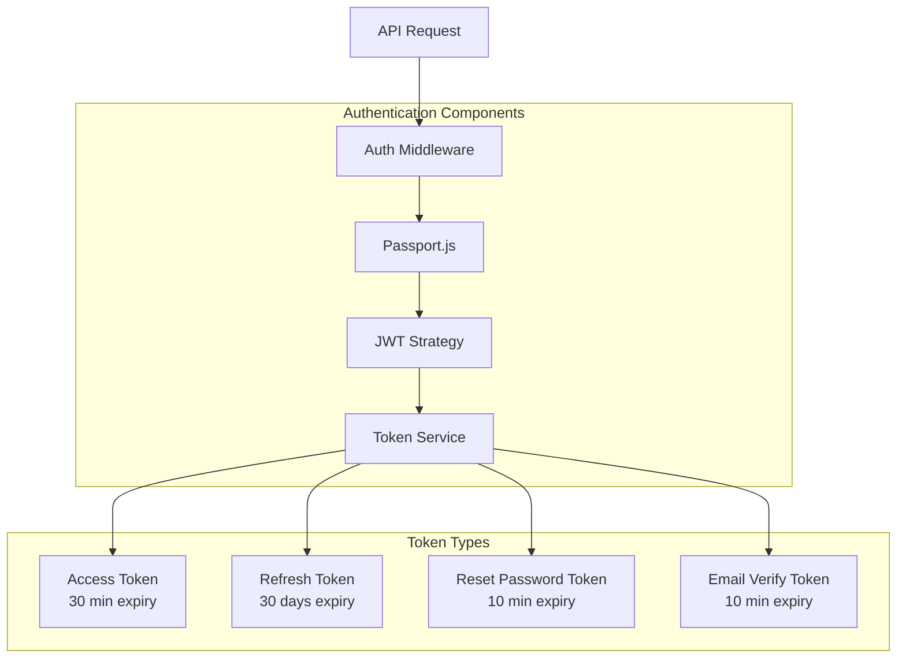
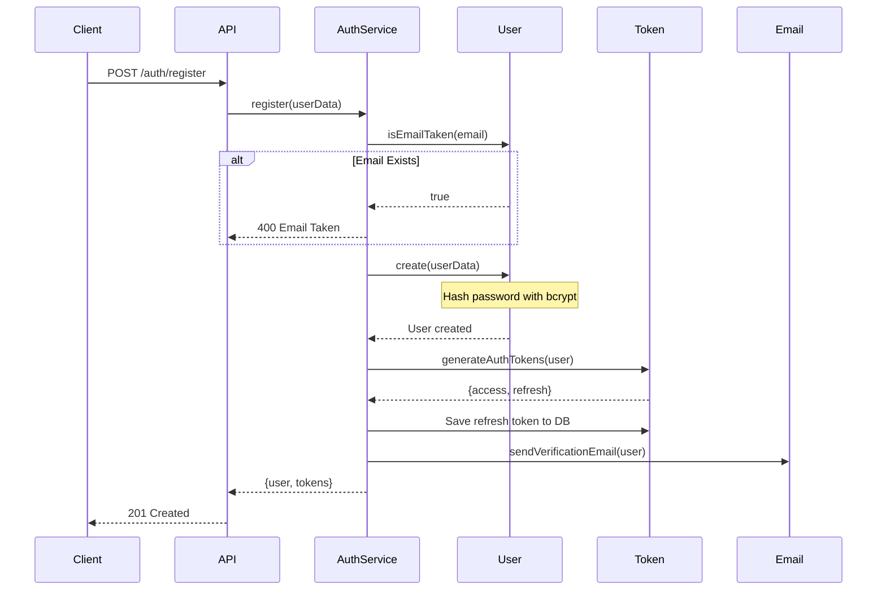
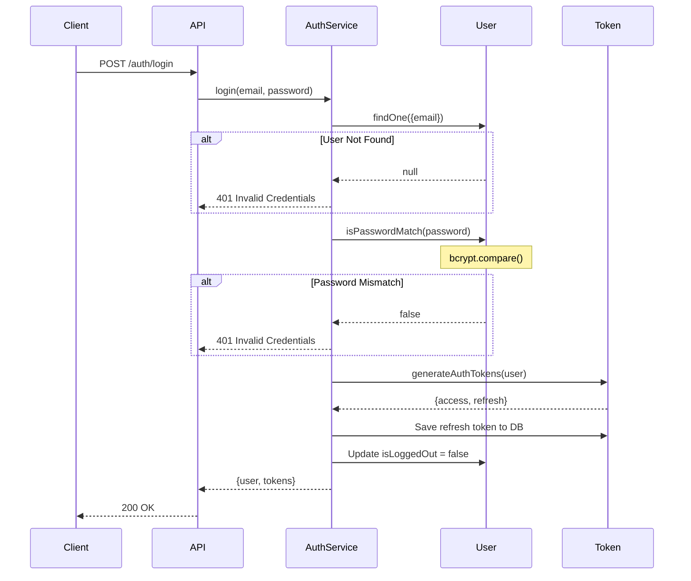
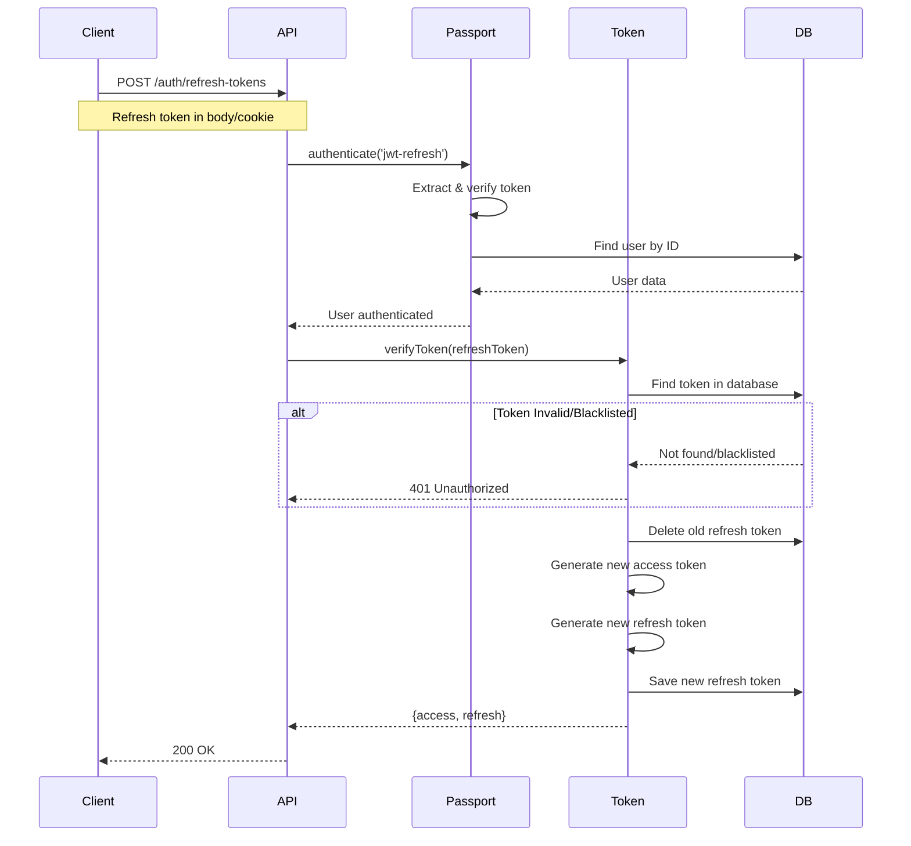
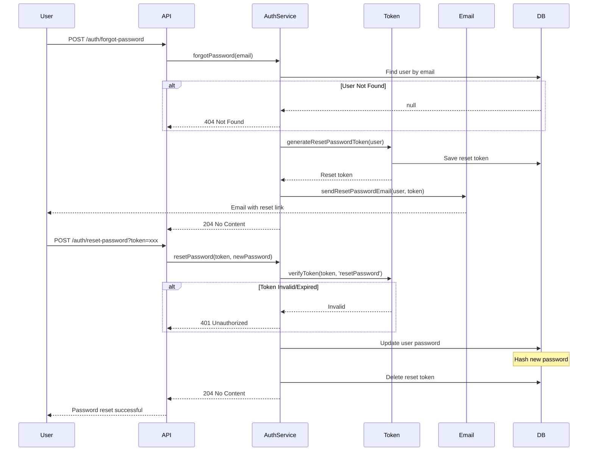

# Authentication & Authorization

## Overview

The application uses **JWT (JSON Web Tokens)** for stateless authentication with **Passport.js** as the authentication middleware. The system implements a dual-token strategy with access and refresh tokens for enhanced security.

## Authentication Architecture



## Token Strategy

### Dual-Token System

The application uses two types of tokens for authentication:

#### 1. Access Token
- **Purpose**: Authenticate API requests
- **Expiry**: 30 minutes (configurable)
- **Storage**: Client-side (memory/localStorage)
- **Transmission**: Authorization header as Bearer token
- **Type**: `ACCESS`

#### 2. Refresh Token
- **Purpose**: Obtain new access tokens
- **Expiry**: 30 days (configurable)
- **Storage**: Database + Client-side (httpOnly cookie recommended)
- **Transmission**: Request body/cookie/custom header
- **Type**: `REFRESH`

### Token Structure

```javascript
// Access Token Payload
{
  sub: "user_id",           // Subject (user ID)
  type: "ACCESS",           // Token type
  iat: 1234567890,          // Issued at
  exp: 1234569690           // Expiration (30 min later)
}

// Refresh Token Payload
{
  sub: "user_id",
  type: "REFRESH",
  iat: 1234567890,
  exp: 1237159890           // Expiration (30 days later)
}
```

## Passport Configuration

### JWT Strategies

The application registers two Passport strategies:

#### 1. Access Token Strategy (`jwt`)

```javascript
const accessOptions = {
  secretOrKey: config.jwt.accessSecret || config.jwt.secret,
  jwtFromRequest: ExtractJwt.fromAuthHeaderAsBearerToken()
};

const accessVerify = async (payload, done) => {
  try {
    if (payload.type !== tokenTypes.ACCESS) {
      throw new Error('Invalid token type');
    }
    const user = await User.findById(payload.sub);
    if (!user) return done(null, false);
    return done(null, user);
  } catch (err) {
    return done(err, false);
  }
};

passport.use('jwt', new JwtStrategy(accessOptions, accessVerify));
```

#### 2. Refresh Token Strategy (`jwt-refresh`)

```javascript
const refreshExtractor = (req) => {
  if (req?.cookies?.refreshToken) return req.cookies.refreshToken;
  if (req?.headers?.['x-refresh-token']) return req.headers['x-refresh-token'];
  if (req?.body?.refreshToken) return req.body.refreshToken;
  return null;
};

const refreshOptions = {
  secretOrKey: config.jwt.refreshSecret || config.jwt.secret,
  jwtFromRequest: refreshExtractor
};

const refreshVerify = async (payload, done) => {
  try {
    if (payload.type !== tokenTypes.REFRESH) {
      throw new Error('Invalid token type');
    }
    const user = await User.findById(payload.sub);
    if (!user) return done(null, false);
    return done(null, user);
  } catch (err) {
    return done(err, false);
  }
};

passport.use('jwt-refresh', new JwtStrategy(refreshOptions, refreshVerify));
```

## Authentication Middleware

### Auth Middleware Function

```javascript
const auth = (first, ...rest) => async (req, res, next) => {
  const strategy = typeof first === 'string' ? first : 'jwt';
  const requiredRights = typeof first === 'string' 
    ? rest 
    : [first, ...rest].filter(Boolean);

  return new Promise((resolve, reject) => {
    passport.authenticate(
      strategy,
      { session: false },
      verifyCallback(req, resolve, reject, requiredRights, strategy)
    )(req, res, next);
  })
    .then(() => next())
    .catch(next);
};
```

### Usage Examples

```javascript
// Basic authentication (any authenticated user)
router.get('/profile', auth(), controller.getProfile);

// With specific strategy
router.post('/refresh', auth('jwt-refresh'), controller.refreshTokens);

// With role-based permissions
router.get('/users', auth('jwt', 'manageUsers'), controller.getAllUsers);

// Multiple permissions
router.post('/admin', auth('jwt', 'manageUsers', 'can'), controller.adminAction);
```

## Role-Based Access Control (RBAC)

### Roles Definition

```javascript
const allRoles = {
  buyer: ['getUsers'],
  seller: ['can', 'getUsers'],
  admin: ['can', 'getUsers', 'manageUsers']
};
```

### Role Hierarchy

| Role | Rights | Description |
|------|--------|-------------|
| **buyer** | `getUsers` | Can access own data |
| **seller** | `can`, `getUsers` | Can manage own store and products |
| **admin** | `can`, `getUsers`, `manageUsers` | Full system access |

### Permission Checking

```javascript
const verifyCallback = (req, resolve, reject, requiredRights, strategy) => 
  async (err, user, info) => {
    if (err || info || !user) {
      return reject(
        new ApiError(httpStatus.UNAUTHORIZED, `Please authenticate - ${strategy}`)
      );
    }
    req.user = user;

    if (requiredRights.length) {
      const userRights = roleRights.get(user.role) || [];
      const hasRequiredRights = requiredRights.every(r => userRights.includes(r));
      if (!hasRequiredRights) {
        return reject(new ApiError(httpStatus.FORBIDDEN, 'Forbidden'));
      }
    }
    resolve();
  };
```

## Authentication Flows

### Registration Flow



### Login Flow



### Token Refresh Flow



### Password Reset Flow



## Password Security

### Hashing Strategy

- **Algorithm**: bcrypt
- **Salt Rounds**: 8
- **Implementation**: Pre-save hook in User model

```javascript
userSchema.pre('save', async function (next) {
  const user = this;
  if (user.isModified('password')) {
    user.password = await bcrypt.hash(user.password, 8);
  }
  next();
});
```

### Password Validation

```javascript
// Schema validation
password: {
  type: String,
  required: true,
  minlength: 8,
  validate(value) {
    if (!value.match(/\d/) || !value.match(/[a-zA-Z]/)) {
      throw new Error('Password must contain at least one letter and one number');
    }
  }
}

// Joi validation
password: Joi.string()
  .min(8)
  .pattern(/^(?=.*[a-zA-Z])(?=.*\d)/)
  .required()
  .messages({
    'string.pattern.base': 'Password must contain at least one letter and one number'
  })
```

## Email Verification

### Verification Flow

1. User registers → Verification email sent
2. User clicks link with token
3. Token verified and user marked as verified
4. Token deleted from database

### Implementation

```javascript
// Generate verification token
const verifyEmailToken = await tokenService.generateVerifyEmailToken(user);

// Send email
await emailService.sendVerificationEmail(user.email, verifyEmailToken);

// Verify email
const tokenDoc = await Token.findOne({
  token: verifyToken,
  type: tokenTypes.VERIFY_EMAIL,
  user: userId
});

if (!tokenDoc) {
  throw new ApiError(httpStatus.UNAUTHORIZED, 'Invalid token');
}

await User.updateOne({ _id: userId }, { isEmailVerified: true });
await tokenDoc.remove();
```

## Security Best Practices

### Implemented Security Measures

1. **Token Expiration**: Short-lived access tokens (30 min)
2. **Token Blacklisting**: Refresh tokens stored in DB, can be revoked
3. **Password Hashing**: bcrypt with 8 salt rounds
4. **Token Type Validation**: Prevents token type confusion attacks
5. **HTTPS Only**: Tokens should only be transmitted over HTTPS in production
6. **HttpOnly Cookies**: Recommended for refresh token storage
7. **Rate Limiting**: Authentication endpoints rate-limited
8. **Input Validation**: All inputs validated with Joi
9. **SQL Injection Prevention**: MongoDB sanitization
10. **XSS Protection**: xss-clean middleware

### Environment Variables

```env
JWT_SECRET=your-secret-key-here
JWT_ACCESS_EXPIRATION_MINUTES=30
JWT_REFRESH_EXPIRATION_DAYS=30
JWT_RESET_PASSWORD_EXPIRATION_MINUTES=10
JWT_VERIFY_EMAIL_EXPIRATION_MINUTES=10
```

## Common Authentication Scenarios

### Scenario 1: New User Registration
1. User submits registration form
2. System validates input
3. System checks if email exists
4. Password is hashed
5. User created in database
6. Access & refresh tokens generated
7. Verification email sent
8. Tokens returned to client

### Scenario 2: Existing User Login
1. User submits credentials
2. System finds user by email
3. Password verified with bcrypt
4. New tokens generated
5. Old refresh tokens optionally revoked
6. User status updated (isLoggedOut = false)
7. Tokens returned to client

### Scenario 3: Token Expiration
1. Client makes request with expired access token
2. Server returns 401 Unauthorized
3. Client uses refresh token to get new access token
4. New access token used for subsequent requests

### Scenario 4: Logout
1. Client sends logout request with refresh token
2. Server finds and deletes refresh token from database
3. Client discards both tokens
4. User status updated (isLoggedOut = true)

## Next Steps

- [API Endpoints](./05-api-endpoints.md) - Authentication endpoints
- [System Flow](./03-system-flow.md) - Authentication flow diagrams
- [Deployment](./09-deployment.md) - Production security configuration
