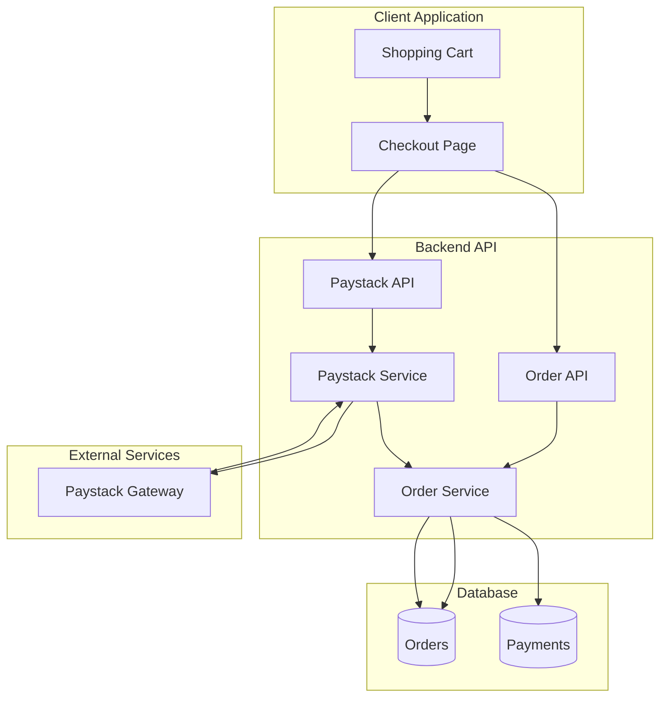
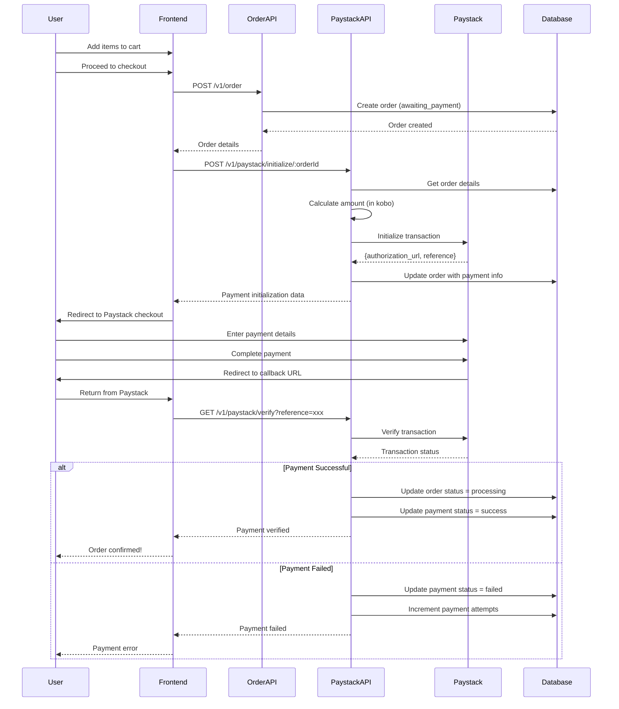
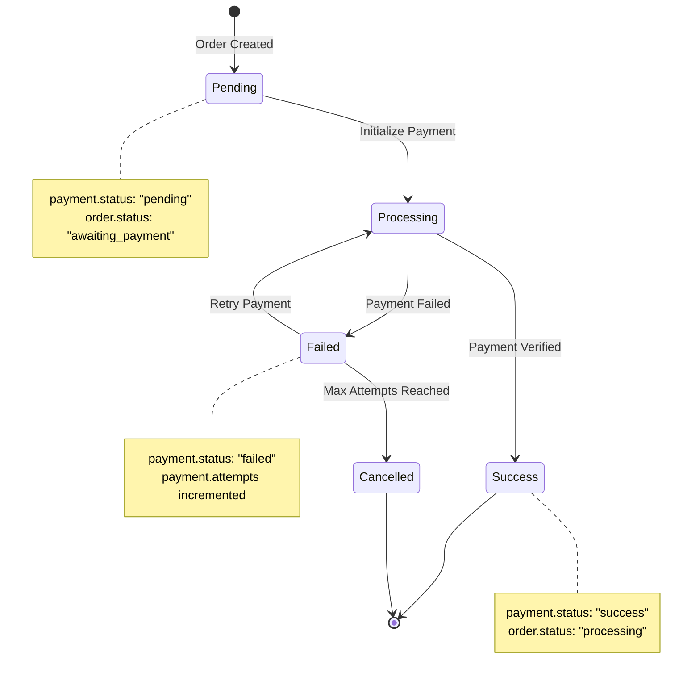

# Payment Integration - Paystack

## Overview

The application integrates with **Paystack**, a leading African payment gateway, to process online payments. Paystack supports multiple payment methods including cards, bank transfers, USSD, and mobile money.

## Integration Architecture



## Configuration

### Environment Variables

```env
PAYSTACK_SECRET_KEY=sk_test_xxxxxxxxxxxxxxxxxxxxx
PAYSTACK_PUBLIC_KEY=pk_test_xxxxxxxxxxxxxxxxxxxxx
PAYSTACK_CALLBACK_URL=http://localhost:3000/v1/paystack/verify
```

### Paystack Configuration

```javascript
// config/config.js
module.exports = {
  paystack: {
    secretKey: process.env.PAYSTACK_SECRET_KEY,
    publicKey: process.env.PAYSTACK_PUBLIC_KEY,
    callbackUrl: process.env.PAYSTACK_CALLBACK_URL
  }
};
```

## Payment Flow

### Complete Payment Process



## API Endpoints

### Initialize Payment

**Endpoint:** `POST /v1/paystack/initialize/:orderId`

**Authentication:** Required (Bearer token)

**Request:**
```http
POST /v1/paystack/initialize/order_123
Authorization: Bearer {access_token}
```

**Response:**
```json
{
  "status": true,
  "message": "Authorization URL created",
  "data": {
    "authorization_url": "https://checkout.paystack.com/xxxxxxxxxx",
    "access_code": "xxxxxxxxxx",
    "reference": "ref_xxxxxxxxxx"
  }
}
```

### Verify Payment

**Endpoint:** `GET /v1/paystack/verify?reference={reference}`

**Request:**
```http
GET /v1/paystack/verify?reference=ref_xxxxxxxxxx
```

**Response:**
```json
{
  "status": true,
  "message": "Verification successful",
  "data": {
    "id": 123456789,
    "status": "success",
    "reference": "ref_xxxxxxxxxx",
    "amount": 250000,
    "currency": "NGN",
    "paid_at": "2024-01-01T12:00:00.000Z",
    "channel": "card",
    "metadata": {
      "orderId": "order_123",
      "userId": "user_456"
    }
  }
}
```

## Implementation Details

### Payment Initialization

```javascript
// paystack.controller.js
const initializeTransaction = catchAsync(async (req, res) => {
  const orderId = req.params.orderId;
  const order = await Order.findById(orderId);
  
  const paymentData = await paystackService.initializeTransaction(
    {
      ...order.toJSON(),
      email: req.user.email
    },
    req.user.id
  );
  
  res.status(httpStatus.OK).send(paymentData);
});
```

### Payment Service

```javascript
// paystack.service.js
const initializeTransaction = async (orderData, userId) => {
  // Convert amount to kobo (Paystack uses smallest currency unit)
  const amountInKobo = Math.round(orderData.total * 100);
  
  const initializationData = {
    email: orderData.email,
    amount: amountInKobo,
    currency: 'NGN',
    reference: generateReference(),
    callback_url: config.paystack.callbackUrl,
    metadata: {
      orderId: orderData.id,
      userId: userId,
      custom_fields: [
        {
          display_name: "Order ID",
          variable_name: "order_id",
          value: orderData.id
        }
      ]
    }
  };
  
  const response = await axios.post(
    'https://api.paystack.co/transaction/initialize',
    initializationData,
    {
      headers: {
        Authorization: `Bearer ${config.paystack.secretKey}`,
        'Content-Type': 'application/json'
      }
    }
  );
  
  // Update order with payment information
  await Order.findByIdAndUpdate(orderData.id, {
    'payment.reference': response.data.data.reference,
    'payment.authorization_url': response.data.data.authorization_url,
    'payment.attempts': (orderData.payment?.attempts || 0) + 1,
    'payment.lastAttempt': new Date()
  });
  
  return response.data;
};
```

### Payment Verification

```javascript
// paystack.service.js
const verifyTransaction = async (reference) => {
  const response = await axios.get(
    `https://api.paystack.co/transaction/verify/${reference}`,
    {
      headers: {
        Authorization: `Bearer ${config.paystack.secretKey}`
      }
    }
  );
  
  const { data } = response.data;
  
  if (data.status === 'success') {
    // Update order status
    await Order.findByIdAndUpdate(
      data.metadata.orderId,
      {
        $set: {
          'payment.status': 'success',
          'payment.reference': reference,
          'payment.paymentDate': new Date(),
          'payment.transaction_id': data.id,
          status: 'processing'
        }
      },
      { new: true }
    );
  } else {
    // Update payment failure
    await Order.findByIdAndUpdate(
      data.metadata.orderId,
      {
        $set: {
          'payment.status': 'failed'
        }
      }
    );
  }
  
  return response.data;
};
```

## Payment States

### Order Payment Status Flow



## Order Schema Payment Fields

```javascript
{
  payment: {
    reference: String,              // Paystack reference
    status: String,                 // pending, success, failed
    amount: Number,                 // Amount in currency
    paymentDate: Date,              // When payment was completed
    gateway: String,                // Default: 'paystack'
    attempts: Number,               // Number of payment attempts
    lastAttempt: Date,              // Last payment attempt timestamp
    authorization_url: String,      // Paystack checkout URL
    transaction_id: String          // Paystack transaction ID
  }
}
```

## Supported Payment Methods

Paystack supports multiple payment channels:

| Method | Description | Availability |
|--------|-------------|--------------|
| **Card** | Debit/Credit cards (Visa, Mastercard, Verve) | All countries |
| **Bank Transfer** | Direct bank transfer | Nigeria |
| **USSD** | Mobile banking codes | Nigeria |
| **Mobile Money** | Mobile wallet payments | Ghana, Kenya |
| **QR Code** | Scan to pay | Nigeria |
| **Bank** | Pay via bank account | Nigeria |

## Error Handling

### Common Error Scenarios

```javascript
// Payment initialization errors
try {
  const paymentData = await paystackService.initializeTransaction(order, userId);
} catch (error) {
  if (error.response?.status === 400) {
    throw new ApiError(httpStatus.BAD_REQUEST, 'Invalid payment data');
  }
  if (error.response?.status === 401) {
    throw new ApiError(httpStatus.UNAUTHORIZED, 'Invalid Paystack credentials');
  }
  throw new ApiError(httpStatus.INTERNAL_SERVER_ERROR, 'Payment initialization failed');
}

// Payment verification errors
try {
  const verification = await paystackService.verifyTransaction(reference);
} catch (error) {
  if (error.response?.status === 404) {
    throw new ApiError(httpStatus.NOT_FOUND, 'Transaction not found');
  }
  throw new ApiError(httpStatus.INTERNAL_SERVER_ERROR, 'Payment verification failed');
}
```

### Retry Logic

```javascript
// Maximum payment attempts
const MAX_PAYMENT_ATTEMPTS = 3;

// Check if retry is allowed
if (order.payment.attempts >= MAX_PAYMENT_ATTEMPTS) {
  await Order.findByIdAndUpdate(orderId, {
    status: 'cancelled',
    'payment.status': 'failed'
  });
  throw new ApiError(httpStatus.BAD_REQUEST, 'Maximum payment attempts exceeded');
}
```

## Webhook Integration (Optional)

For production environments, implement webhook handling for real-time payment notifications:

```javascript
// paystack.route.js
router.post('/webhook', paystackController.handleWebhook);

// paystack.controller.js
const handleWebhook = catchAsync(async (req, res) => {
  // Verify webhook signature
  const hash = crypto
    .createHmac('sha512', config.paystack.secretKey)
    .update(JSON.stringify(req.body))
    .digest('hex');
  
  if (hash !== req.headers['x-paystack-signature']) {
    throw new ApiError(httpStatus.UNAUTHORIZED, 'Invalid signature');
  }
  
  const event = req.body;
  
  if (event.event === 'charge.success') {
    const { reference, metadata } = event.data;
    
    await Order.findByIdAndUpdate(metadata.orderId, {
      'payment.status': 'success',
      'payment.reference': reference,
      'payment.paymentDate': new Date(),
      status: 'processing'
    });
  }
  
  res.status(httpStatus.OK).send({ received: true });
});
```

## Testing

### Test Credentials

Paystack provides test cards for development:

| Card Number | CVV | Expiry | PIN | Result |
|-------------|-----|--------|-----|--------|
| 4084084084084081 | 408 | 12/30 | 0000 | Success |
| 5060666666666666666 | 123 | 12/30 | 1234 | Success (requires OTP) |
| 507850785078507812 | 884 | 12/30 | - | Declined |

### Test Mode

```javascript
// Use test keys in development
PAYSTACK_SECRET_KEY=sk_test_xxxxxxxxxxxxxxxxxxxxx
PAYSTACK_PUBLIC_KEY=pk_test_xxxxxxxxxxxxxxxxxxxxx
```

## Security Considerations

1. **Never expose secret key**: Keep `PAYSTACK_SECRET_KEY` server-side only
2. **Verify all transactions**: Always verify payment on backend, never trust client
3. **Use HTTPS**: All Paystack API calls must use HTTPS
4. **Validate webhook signatures**: Verify webhook authenticity
5. **Amount validation**: Verify payment amount matches order total
6. **Idempotency**: Handle duplicate payment attempts gracefully

## Currency Conversion

```javascript
// Convert to kobo (smallest unit)
const amountInKobo = Math.round(amountInNaira * 100);

// Convert from kobo
const amountInNaira = amountInKobo / 100;
```

## Production Checklist

- [ ] Replace test keys with live keys
- [ ] Configure production callback URL
- [ ] Implement webhook handling
- [ ] Set up payment monitoring
- [ ] Configure email notifications for failed payments
- [ ] Implement payment reconciliation
- [ ] Set up error logging and alerting
- [ ] Test with real payment methods
- [ ] Verify PCI compliance requirements
- [ ] Document refund process

## Next Steps

- [API Endpoints](./05-api-endpoints.md) - Payment endpoints
- [System Flow](./03-system-flow.md) - Payment flow diagrams
- [Deployment](./09-deployment.md) - Production configuration
